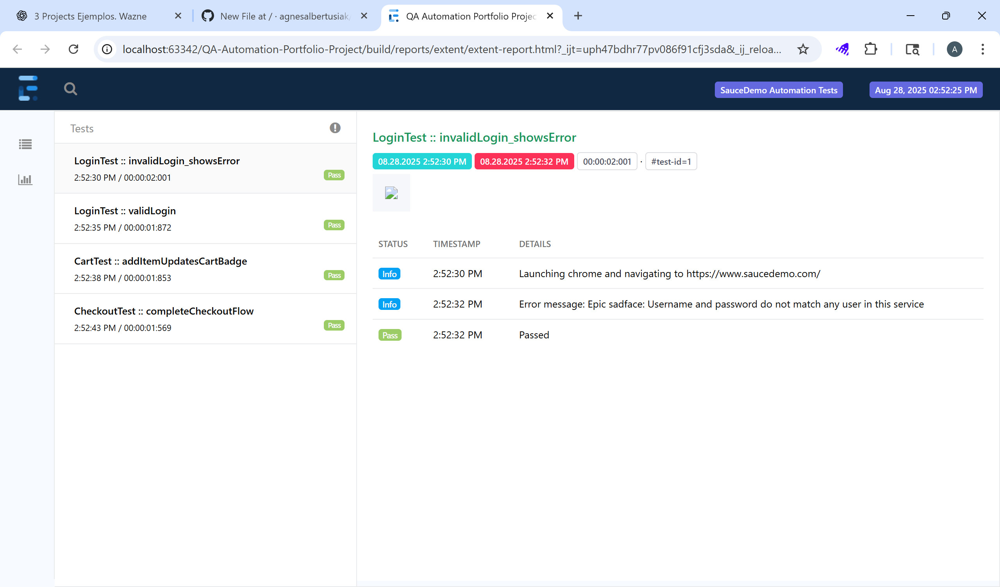

# QA Automation Portfolio Project1  

This project is a **QA Automation Framework** built for [SauceDemo](https://www.saucedemo.com/), demonstrating skills in **Java, Selenium WebDriver, TestNG, Gradle, and ExtentReports**.  
It simulates real-world QA practices using the **Page Object Model (POM)**, cross-browser testing, and data-driven testing concepts.  

---

## 🚀 Features  
- ✅ Automated end-to-end test flows on SauceDemo  
- ✅ **Page Object Model (POM)** for clean, maintainable code  
- ✅ **Cross-browser testing** (Chrome & Firefox) using WebDriverManager  
- ✅ **ExtentReports** with screenshots on test failures  
- ✅ Configurable test data in `config.properties`  
- ✅ Tests included:  
  - Valid Login  
  - Invalid Login (error message validation)  
  - Add Product to Cart  
  - Checkout Process   

---

## 🛠️ Tech Stack  
- **Language:** Java  
- **Test Framework:** TestNG  
- **Automation Tool:** Selenium WebDriver  
- **Build Tool:** Gradle  
- **Reports:** ExtentReports  
- **Version Control:** Git/GitHub  

---

## 📂 Project Structure  
QA-Automation-Portfolio-Project
│── .gitignore
│── build.gradle
│── config.properties
│── gradlew
│── gradlew.bat
│── settings.gradle
│── testng.xml
│
├── reports                # ExtentReports output folder
│
├── src
│   ├── main
│   │   └── java
│   │       ├── pages
│   │       │   ├── CartPage.java
│   │       │   ├── CheckoutPage.java
│   │       │   ├── LoginPage.java
│   │       │   └── ProductsPage.java
│   │       │
│   │       └── utils
│   │           ├── ConfigReader.java
│   │           ├── DriverFactory.java
│   │           ├── ExtentManager.java
│   │           └── TestUtils.java
│   │
│   └── resources
│
├── src
│   └── test
│       └── java
│           ├── base
│           │   └── BaseTest.java
│           │
│           └── tests
│               ├── CartTest.java
│               ├── CheckoutTest.java
│               └── LoginTest.java
│
└── src
    └── test
        └── resources

---

## ⚙️ Setup & Run  

### 1️⃣ Clone the repository  
git clone https://github.com/agnesalbertusiak/QA-Automation-Portfolio-Project1.git

### 2️⃣ Navigate into the project folder
cd QA-Automation-Portfolio-Project1

### 3️⃣ Run tests with Gradle
./gradlew clean test

### 4️⃣ View test report 
/build/reports/extent/extent-report.html
in your browser to view results with screenshots

## 📸 Sample Report Screenshot  
Here is a preview of the **ExtentReport** generated after running the test suite:  

## 👩‍💻 Author  
**Agnes Albertusiak**  
- 💼 [LinkedIn](https://www.linkedin.com/in/agnes-a-682903165/)  
- 📂 [GitHub](https://github.com/agnesalbertusiak)  

